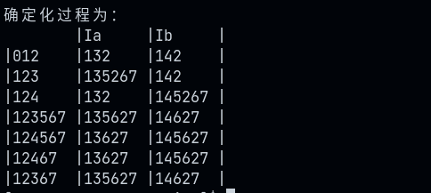
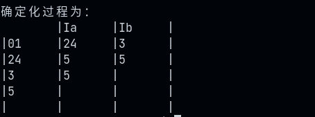

# 不确定自动机的确定化算法实现
## 测试
### 用例1
```c++
/*
12
0 & 1
1 a 1
1 b 1
1 & 2
2 a 3
2 b 4
3 a 5
4 b 5
5 & 6
6 a 6
6 b 6
6 & 7
*/
```
#### 输出结果

### 用例2
```c++
/*
7
0 & 1
1 a 2
1 a 4
1 b 3
2 a 5
4 b 5
3 a 5
*/
```
#### 输出结果
